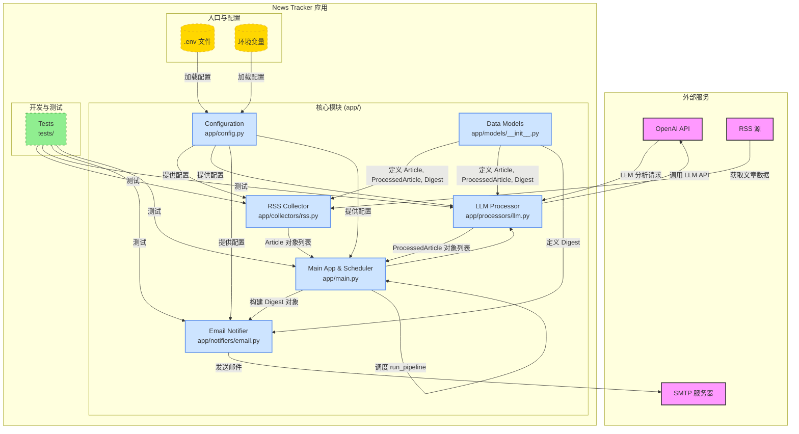

# News Tracker

An application to track specific topics from RSS feeds (or automatically discover them), summarize information using a Large Language Model (LLM), and send notifications via email.

## Features

*   **RSS Feed Aggregation**: Collects articles from configurable RSS sources.
*   **LLM-Powered Summarization**: Processes articles using OpenAI's GPT models (or compatible APIs) to extract summaries, key points, sentiment, and tags.
*   **Email Notifications**: Sends a compiled digest of processed articles to configured recipients.
*   **Data Persistence**: Stores collected articles, processed summaries, and digests in SQLite database for historical reference and analysis.
*   **Configurable Scheduling**: Runs the collection, processing, and notification pipeline on a user-defined schedule using APScheduler.
*   **Asynchronous Architecture**: Built with `asyncio` and `aiohttp` for efficient, non-blocking I/O operations.
*   **Centralized Configuration**: Manages settings via `pydantic-settings`, supporting environment variables and `.env` files.

## Tech Stack

*   **Language**: Python 3.13+
*   **Environment & Dependency Management**: `uv` with `pyproject.toml`
*   **Asynchronous Programming**: `asyncio`, `aiohttp`
*   **Task Scheduling**: `APScheduler`
*   **Configuration Management**: `pydantic-settings`
*   **Data Modeling**: `pydantic`
*   **Database ORM**: `SQLAlchemy` with SQLite
*   **Testing**: `pytest`, `pytest-asyncio`
*   **Development Approach**: Test-Driven Development (TDD)

## Quick Start

### Prerequisites

*   Python 3.13+ installed.
*   `uv` package manager installed (`pip install uv`).
*   An OpenAI API key (or compatible LLM API key).
*   Access to an SMTP server for sending emails (e.g., Gmail SMTP, SendGrid, or a service like Mailtrap for testing).

### 1. Setup

1.  **Clone the repository**:
    ```bash
    git clone <repository-url>
    cd news-track
    ```

2.  **Create a virtual environment and install dependencies**:
    `uv` will automatically create and manage the virtual environment.
    ```bash
    uv sync
    ```
    This command reads `pyproject.toml` and sets up the environment.

3.  **Activate the virtual environment**:
    ```bash
    source .venv/bin/activate
    ```
    (On Windows: `.venv\Scripts\activate`)

### 2. Configuration

The application is configured using environment variables. You can set these directly in your environment or use a `.env` file.

1.  **Create a `.env` file**:
    Copy the example file and edit it.
    ```bash
    cp .env.example .env
    ```

2.  **Edit `.env`**:
    Open the `.env` file and fill in the required values:
    *   `OPENAI_API_KEY`: Your OpenAI API key.
    *   **RSS Sources**: Configure RSS feed URLs:
        *   `RSS__FEED_URL`: A single RSS feed URL (e.g., `https://venturebeat.com/category/ai/feed/`).
        *   `RSS__FEED_URLS`: A JSON array of multiple RSS feed URLs (e.g., `["url1", "url2"]`).
        *   `RSS__TOPIC`: The main topic you want to track (e.g., `AI Latest News`).
    *   `EMAIL__SMTP_SERVER`, `EMAIL__SMTP_PORT`, `EMAIL__USERNAME`, `EMAIL__PASSWORD`: Your SMTP server details.
    *   `EMAIL__SENDER_EMAIL`: The email address the digest will be sent from.
    *   `EMAIL__RECIPIENT_EMAILS`: A comma-separated list of recipient email addresses.
    *   `DATABASE__PATH`: Path to the SQLite database file (default: `data/news_tracker.db`).
    *   `SCHEDULER__*`: (Optional) Adjust the schedule (default: daily at 09:00 AM in `SCHEDULER__TIMEZONE`).

    **Example `.env` snippet**:
    ```env
    # --- LLM Processor ---
    OPENAI_API_KEY=sk-your-actual-openai-api-key-here
    LLM__MODEL=gpt-4o-mini

    # --- RSS Collector ---
    RSS__FEED_URLS=["https://techcrunch.com/category/artificial-intelligence/feed/", "https://venturebeat.com/category/ai/feed/"]
    RSS__TOPIC=AI Latest News

    # --- Email Notifier ---
    # Example using Mailtrap for testing
    EMAIL__SMTP_SERVER=sandbox.smtp.mailtrap.io
    EMAIL__SMTP_PORT=587
    EMAIL__USERNAME=your-mailtrap-username
    EMAIL__PASSWORD=your-mailtrap-password
    EMAIL__SENDER_EMAIL=your-verified-sender@example.com
    EMAIL__RECIPIENT_EMAILS=your-email@example.com
    ```


### 3. Run the Application

Make sure your virtual environment is activated (`source .venv/bin/activate`).

*   **Run the pipeline once**:
    Executes the collection, processing, and sending steps immediately.
    ```bash
    python -m app.main --mode once
    ```

*   **Start the scheduler**:
    Starts the application in the background, running the pipeline according to the schedule defined in your configuration.
    ```bash
    python -m app.main --mode schedule
    ```
    Press `Ctrl+C` to stop the scheduler.

## Project Structure

```
news-track/
├── app/                    # Application source code
│   ├── collectors/         # Modules for collecting data (e.g., RSS)
│   ├── processors/         # Modules for processing data (e.g., LLM)
│   ├── notifiers/          # Modules for sending notifications (e.g., Email)
│   ├── models/             # Pydantic data models
│   ├── config.py           # Centralized application configuration
│   └── main.py             # Main application logic and scheduler
├── tests/                  # Unit and integration tests
├── data/                   # (Optional) Directory for local data storage
├── logs/                   # (Optional) Directory for application logs
├── .env.example            # Example environment configuration file
├── .gitignore
├── pyproject.toml          # Project metadata and dependencies (used by uv)
├── README.md               # This file
└── requirements.txt        # (Generated by uv) Locked dependencies
```

## Architecture



*Note: To view this diagram, paste the Mermaid code into a [Mermaid Live Editor](https://mermaid.live/edit) or use a Markdown viewer that supports Mermaid.*

## Development & Testing

This project follows a Test-Driven Development (TDD) approach.

*   **Run all tests**:
    ```bash
    source .venv/bin/activate
    python -m pytest
    ```

*   **Run specific test files**:
    ```bash
    python -m pytest tests/test_rss_collector.py -v
    ```

*   **Add a new dependency**:
    ```bash
    uv add <package-name>
    ```
    This will update `pyproject.toml` and `uv.lock`.

*   **Update dependencies**:
    ```bash
    uv lock --upgrade  # Upgrade all dependencies
    uv lock --upgrade-package <package-name> # Upgrade a specific package
    ```